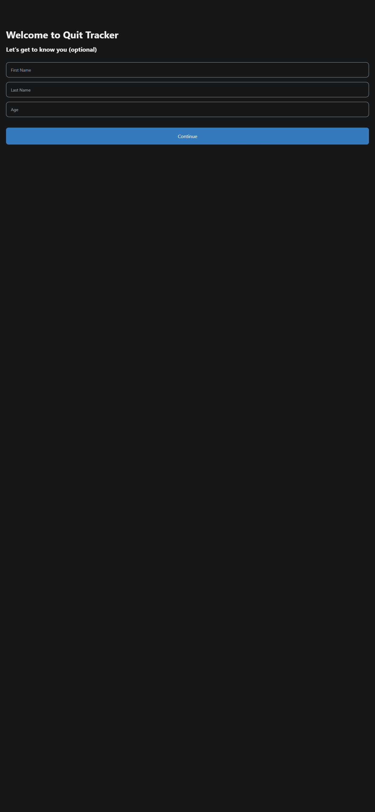
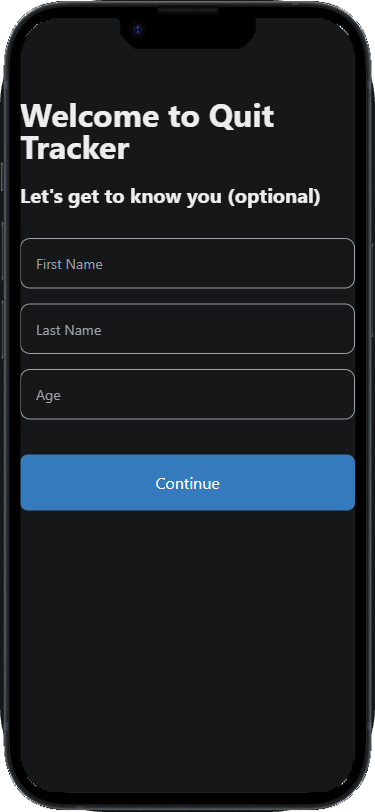
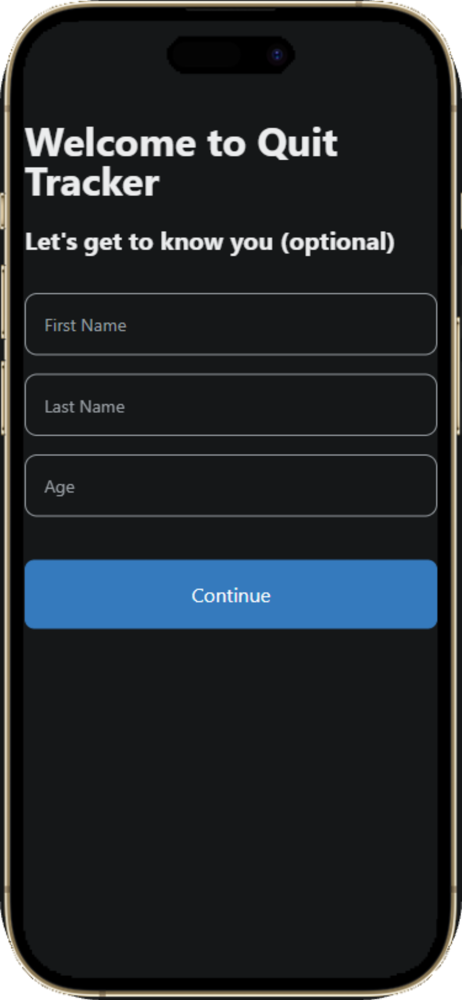

# Expo Screenshotter

[](https://www.npmjs.com/package/expo-screenshotter)
[](https://github.com/TheRealPerson98/expo-screenshotter/blob/main/LICENSE)
[](https://github.com/TheRealPerson98/expo-screenshotter/issues)
[](https://github.com/TheRealPerson98/expo-screenshotter/actions)

A command-line tool for automatically taking screenshots of Expo web apps at different screen sizes. Perfect for generating marketing materials, documentation, or testing responsive designs.

## Features

- Take screenshots at predefined or custom screen sizes
- Support for scrolling to capture full-page screenshots
- Configurable delay to ensure content is fully loaded
- Customizable output directory
- Batch screenshot multiple URLs
- Supports custom viewport configurations
- **NEW:** Place screenshots inside device frames (iPhone or Android)
- **NEW:** Multiple iPhone frame styles (pill or notch) and colors
- **NEW:** Android frames in different sizes (compact or medium) and colors

> **Note:** Device framing is fully implemented for both iPhone and Android frames. The tool will take your screenshot and overlay the device frame on top of it, maintaining the screenshot's dimensions.

## Installation

```bash
npm install -g expo-screenshotter
```

### Device Frame Assets

To use the device frame feature, you need to have the frame images in the correct location.

#### iPhone Frames
The tool looks for iPhone frame images in the `src/assets/iphones` directory with this naming convention:
- `Pill=true, Color=Space Black.png`
- `Pill=true, Color=Gold.png`
- `Pill=true, Color=Silver.png`
- `Pill=true, Color=Deep Purple.png`
- `Pill=False, Color=Starlight.png`
- `Pill=False, Color=Midnight.png`
- `Pill=False, Color=Red.png`
- `Pill=False, Color=Blue.png`

#### Android Frames
The tool looks for Android frame images in the `src/assets/android` directory with this naming convention:
- `Android Compact Black.png`
- `Android Compact Silver.png`
- `Android Medium Black.png`
- `Android Medium Silver.png`

If you're using this tool as a dependency in your project, you may need to create the appropriate asset directories and add the frame images manually.

## Usage

There are two main commands:

### Initialize Configuration

```bash
expo-screenshotter init
```

This creates a default `expo-screenshotter.json` configuration file in your project. You can then customize this file for your needs.

### Take Screenshots

```bash
expo-screenshotter capture
```

This will use your `expo-screenshotter.json` configuration to take screenshots. Make sure your Expo web app is running first with `expo start --web`.

### Configuration File (expo-screenshotter.json)

The configuration file controls all aspects of the screenshot process. Here's an example:

```json
{
  "views": [
    {
      "name": "Home",
      "path": "/"
    },
    {
      "name": "Add Logs",
      "path": "/add-log"
    },
    {
      "name": "Goals",
      "path": "/goals"
    },
    {
      "name": "Logs",
      "path": "/logs"
    }
  ],
  "sizes": [
    {
      "width": 375,
      "height": 812,
      "name": "iPhone X"
    },
    {
      "width": 1280,
      "height": 800,
      "name": "Tablet"
    },
    {
      "width": 2560,
      "height": 1440,
      "name": "Desktop"
    },
    {
      "width": 1280,
      "height": 800,
      "name": "Tablet Full Page",
      "fullPage": true
    },
    {
      "width": 375,
      "height": 812,
      "name": "iPhone X with Frame",
      "useDeviceFrame": true,
      "deviceType": "iphone",
      "iphoneOptions": {
        "pill": true,
        "color": "Space Black"
      }
    },
    {
      "width": 375,
      "height": 812,
      "name": "iPhone X with Gold Frame",
      "useDeviceFrame": true,
      "deviceType": "iphone",
      "iphoneOptions": {
        "pill": true,
        "color": "Gold"
      }
    },
    {
      "width": 375,
      "height": 812,
      "name": "iPhone X with Custom Size",
      "useDeviceFrame": true,
      "deviceType": "iphone",
      "iphoneOptions": {
        "pill": true,
        "color": "Gold",
        "width": 1242,
        "height": 2688
      }
    },
    {
      "width": 360,
      "height": 740,
      "name": "Android Medium Black",
      "useDeviceFrame": true,
      "deviceType": "android",
      "androidOptions": {
        "size": "medium",
        "color": "black"
      }
    },
    {
      "width": 360,
      "height": 740,
      "name": "Android Compact Silver",
      "useDeviceFrame": true,
      "deviceType": "android",
      "androidOptions": {
        "size": "compact",
        "color": "silver"
      }
    },
    {
      "width": 360,
      "height": 740,
      "name": "Android with Custom Size",
      "useDeviceFrame": true,
      "deviceType": "android",
      "androidOptions": {
        "size": "medium",
        "color": "black",
        "width": 1080,
        "height": 2340
      }
    }
  ],
  "outputDir": "./screenshots",
  "expoUrl": "http://localhost:8081",
  "waitTime": 2000,
  "waitForSelector": "#my-element",
  "fullPage": false,
  "useDeviceFrame": false,
  "iphoneOptions": {
    "pill": true,
    "color": "Space Black"
  },
  "androidOptions": {
    "size": "medium",
    "color": "black"
  }
}

```

### Advanced Configuration Options

#### Global Options
- `waitTime`: Delay in milliseconds before taking screenshots (default: 1000)
- `waitForSelector`: CSS selector to wait for before taking screenshots (e.g., "#my-element")
- `fullPage`: Set to `true` to capture the entire scrollable content for all sizes (default: false)
- `useDeviceFrame`: Set to `true` to place all screenshots inside device frames (default: false)
- `deviceType`: Default device frame type to use ('iphone' or 'android')
- `iphoneOptions`: Options for iPhone frames:
  - `pill`: Set to `true` for pill-style (iPhone 14 Pro+) or `false` for notch-style (iPhone 13, 14)
  - `color`: iPhone color ('Gold', 'Space Black', 'Silver', 'Deep Purple', 'Starlight', 'Midnight', 'Red', 'Blue')
  - `width`: Optional target width for the final image (for custom resizing)
  - `height`: Optional target height for the final image (for custom resizing)
- `androidOptions`: Options for Android frames:
  - `size`: Android device size ('compact' or 'medium')
  - `color`: Android device color ('black' or 'silver')
  - `width`: Optional target width for the final image (for custom resizing)
  - `height`: Optional target height for the final image (for custom resizing)

#### Per-Size Options
Each size in the `sizes` array can have these additional options:
- `fullPage`: Override the global fullPage setting for this specific size
- `scrollY`: Scroll vertically by specified pixels before capturing
- `scrollX`: Scroll horizontally by specified pixels before capturing
- `useDeviceFrame`: Override the global useDeviceFrame setting for this specific size
- `deviceType`: Override the global deviceType setting for this specific size
- `iphoneOptions`: Override the global iPhone frame options for this specific size
  - Including `width` and `height` properties to resize the final framed image to specific dimensions
- `androidOptions`: Override the global Android frame options for this specific size
  - Including `width` and `height` properties to resize the final framed image to specific dimensions

For example, to wait for a specific element and capture a full-page screenshot with device frames:
```json
{
  "waitForSelector": "#content-loaded",
  "waitTime": 3000,
  "useDeviceFrame": true,
  "deviceType": "iphone",
  "iphoneOptions": {
    "pill": true,
    "color": "Gold"
  },
  "sizes": [
    {
      "name": "Full Page Mobile",
      "width": 375,
      "height": 812,
      "fullPage": true
    },
    {
      "name": "Scrolled Desktop",
      "width": 1280,
      "height": 800,
      "scrollY": 500
    },
    {
      "name": "iPhone with Notch",
      "width": 375,
      "height": 812,
      "iphoneOptions": {
        "pill": false,
        "color": "Midnight"
      }
    },
    {
      "name": "iPhone with Custom Size",
      "width": 375,
      "height": 812,
      "useDeviceFrame": true,
      "deviceType": "iphone",
      "iphoneOptions": {
        "pill": true,
        "color": "Gold",
        "width": 1242,
        "height": 2688
      }
    },
    {
      "name": "Android Medium Black",
      "width": 360,
      "height": 740,
      "deviceType": "android",
      "androidOptions": {
        "size": "medium",
        "color": "black"
      }
    },
    {
      "name": "Android Compact Silver",
      "width": 360,
      "height": 740,
      "deviceType": "android",
      "androidOptions": {
        "size": "compact",
        "color": "silver"
      }
    },
    {
      "name": "Android with Custom Size",
      "width": 360,
      "height": 740,
      "useDeviceFrame": true,
      "deviceType": "android",
      "androidOptions": {
        "size": "medium",
        "color": "black",
        "width": 1080,
        "height": 2340
      }
    }
  ]
}
```

### Available Device Frame Options

#### iPhone Frames

##### Pill-style (Dynamic Island)
- Gold
- Space Black
- Silver
- Deep Purple

##### Notch-style
- Starlight
- Midnight
- Red
- Blue

#### Android Frames

##### Sizes
- Compact
- Medium

##### Colors
- Black
- Silver

## Development

### Setup

```bash
# Clone the repository
git clone https://github.com/TheRealPerson98/expo-screenshotter.git
cd expo-screenshotter

# Install dependencies
npm install

# Build the project
npm run build
```

### Linting

The project uses ESLint for code quality:

```bash
# Run linting
npm run lint

# Fix linting issues automatically
npm run lint:fix
```

## License

This software is dual-licensed:

### For Individual/Open Source Use
MIT © [Person98 LLC - Jace Sleeman (@TheRealPerson98)](https://github.com/TheRealPerson98)

### For Commercial Use
[Decheck License](https://decheck.xyz/license) © [Person98 LLC - Jace Sleeman]

This software can be used freely in personal and open-source projects. For commercial use, please refer to the Decheck license terms or contact for licensing options. 

## Examples

Here are some examples of screenshots taken with expo-screenshotter:

### Original Screenshot


### With iPhone Notch Frame (Midnight)


### With iPhone Pill Frame (Gold)


### With Android Frame
 